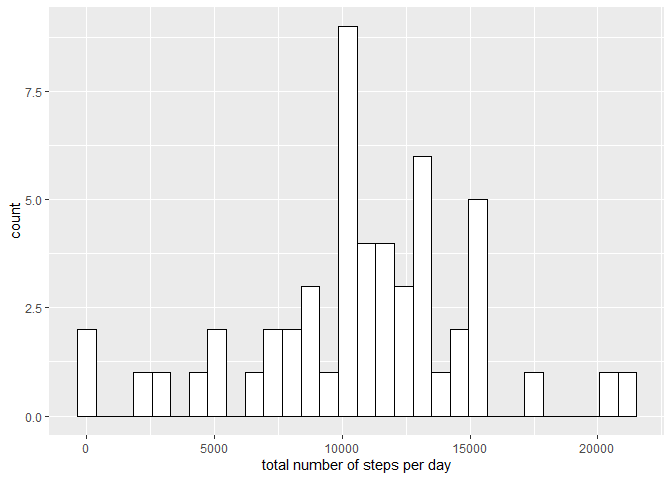
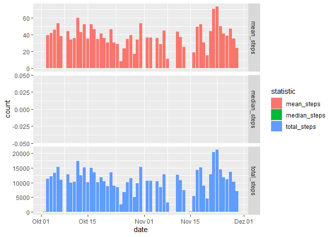
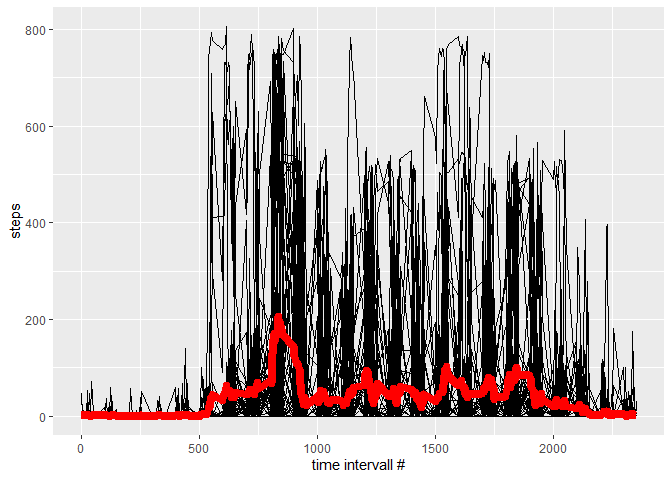
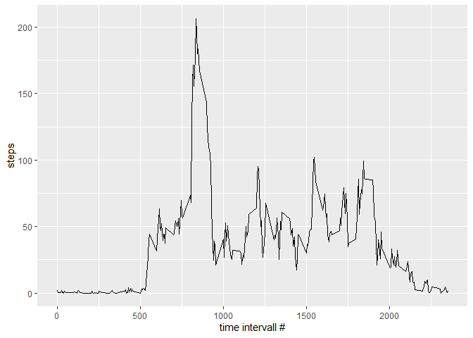
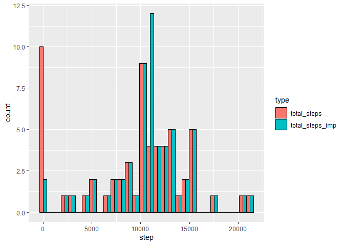
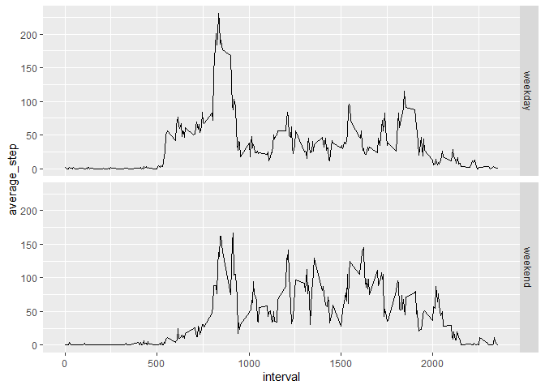

#Reproducible Research: Peer Assessment 1


## Loading and preprocessing the data


```r
activity <- read_csv("activity.zip")
```

```
## 
## -- Column specification --------------------------------------------------------
## cols(
##   steps = col_double(),
##   date = col_date(format = ""),
##   interval = col_double()
## )
```

Inspect the data set


```r
str(activity)
```

```
## spec_tbl_df [17,568 x 3] (S3: spec_tbl_df/tbl_df/tbl/data.frame)
##  $ steps   : num [1:17568] NA NA NA NA NA NA NA NA NA NA ...
##  $ date    : Date[1:17568], format: "2012-10-01" "2012-10-01" ...
##  $ interval: num [1:17568] 0 5 10 15 20 25 30 35 40 45 ...
##  - attr(*, "spec")=
##   .. cols(
##   ..   steps = col_double(),
##   ..   date = col_date(format = ""),
##   ..   interval = col_double()
##   .. )
```

## What is mean total number of steps taken per day?

Calculate the total number of steps per day


```r
steps_per_day<-activity%>%
  drop_na()%>%
  group_by(date)%>%
  summarise(total_steps=sum(steps),
            mean_steps=mean(steps),
            median_steps=median(steps))
```

Plot histogram of total number of steps taken each day


```r
steps_per_day%>%
  ggplot()+
  geom_histogram(aes(total_steps), fill="white", color="black")+
  labs(x="total number of steps per day")
```

```
## `stat_bin()` using `bins = 30`. Pick better value with `binwidth`.
```

<!-- -->
Save Histogram

```r
ggsave("steps_per_day_Histogram.png")
```

```
## Saving 7 x 5 in image
```

```
## `stat_bin()` using `bins = 30`. Pick better value with `binwidth`.
```

Calculate the mean and median of the total number of steps taken per day:

```r
steps_per_day%>%
  summarise(mean_steps=mean(total_steps),
            median_steps=median(total_steps))
```

```
## # A tibble: 1 x 2
##   mean_steps median_steps
##        <dbl>        <dbl>
## 1     10766.        10765
```

Visualize mean and median number of steps taken each day

```r
steps_per_day%>%
  gather(., key="statistic",value="count", -date)%>%
  ggplot(aes(x=date, y=count))+
  geom_col(aes(fill=statistic))+
  facet_grid(statistic~., scales = "free")
```

<!-- -->

Save visualisation

```r
ggsave("Mean_Median_step_per_day.png")
```

```
## Saving 7 x 5 in image
```
## What is the average daily activity pattern?

Visualize the daily activity pattern, including the average number of steps taken, averaged across all days.

```r
activity%>%
  drop_na()%>%
  ggplot(aes(x=interval, y=steps))+
  geom_line(aes(group=date))+
  stat_summary(fun = mean, color="red", geom = "line", size=3)+
  labs(x="time intervall #", y="steps")
```

<!-- -->

Calculate the average daily activity

```r
daily_activity<-
  activity%>%
  drop_na()%>%
  group_by(interval)%>%
  summarise(average_step=mean(steps))
```

Visualize the average daily activity pattern

```r
daily_activity%>%
  ggplot(aes(x=interval, y=average_step))+
  geom_line()+
  labs(x="time intervall #", y="steps")
```

<!-- -->

Save Histogram

```r
ggsave("Time_series_average_steps.png")
```

```
## Saving 7 x 5 in image
```

Which 5-minute interval contains the maximum number of steps? 

```r
daily_activity%>%
  filter(average_step==max(daily_activity$average_step))
```

```
## # A tibble: 1 x 2
##   interval average_step
##      <dbl>        <dbl>
## 1      835         206.
```

## Imputing missing values

Assess number of missing values

```r
activity%>%
  filter(is.na(steps))%>%
  nrow()
```

```
## [1] 2304
```
Fill the missing values with the mean of the respective interval

```r
activiyt_imputed<-
  activity%>%
  group_by(interval)%>%
  mutate(average_step=mean(steps, na.rm=TRUE),
         steps_imp=case_when(is.na(steps)~average_step,
                             TRUE~steps))
```

Calculate the total number of steps per day using both the raw numbers and the imputed numbers. 


```r
steps_per_day_imp<-activiyt_imputed%>%
  group_by(date)%>%
  summarise(total_steps=sum(steps, na.rm=TRUE),
         total_steps_imp=sum(steps_imp))%>%
  gather(., key="type", value = "step", -date)
```

Plot histogram of total number of steps taken each day. Display values of raw data and imputed data side-by-side. 

```r
steps_per_day_imp%>%
  ggplot()+
  geom_histogram(aes(step, fill=type), color="black", position = position_dodge())
```

```
## `stat_bin()` using `bins = 30`. Pick better value with `binwidth`.
```

<!-- -->

Calculate the mean and median of the total number of steps taken per day using both the raw numbers and the imputed numbers. What is the impact of imputing missing data on the estimates of the total daily number of steps?


```r
steps_per_day_imp%>%
  group_by(type)%>%
  summarise(mean_steps=mean(step),
            median_steps=median(step))
```

```
## # A tibble: 2 x 3
##   type            mean_steps median_steps
##   <chr>                <dbl>        <dbl>
## 1 total_steps          9354.       10395 
## 2 total_steps_imp     10766.       10766.
```
Imputation of missing values increases the mean and median values. 

## Are there differences in activity patterns between weekdays and weekends?

Annotate "weekday" and "weekend".

```r
activiyt_imputed%<>%
  rowwise()%>%
  mutate(week=case_when(weekdays(date)%in%c("Samstag","Sonntag")~"weekend",
                   TRUE~"weekday"))
```

Compare the average number of steps across weekdays and weekends
a) In individual panels

```r
activiyt_imputed%>%
  group_by(interval, week)%>%
  summarise(average_step=mean(steps_imp))%>%
  ggplot(aes(x=interval, y=average_step))+
  geom_line()+
  facet_grid(week~.)
```

```
## `summarise()` has grouped output by 'interval'. You can override using the
## `.groups` argument.
```

<!-- -->
a) In one panel

```r
activiyt_imputed%>%
  group_by(interval, week)%>%
  summarise(average_step=mean(steps_imp))%>%
  ggplot(aes(x=interval, y=average_step, color=week))+
  geom_line(size=1)
```

```
## `summarise()` has grouped output by 'interval'. You can override using the
## `.groups` argument.
```

<!-- -->
